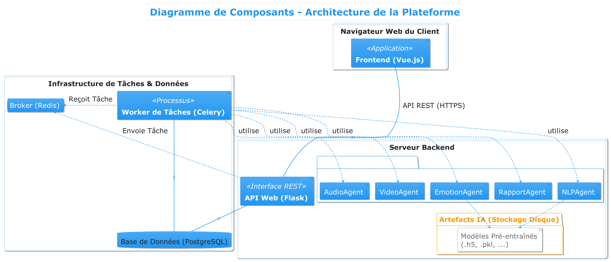

# Plateforme d'Analyse Multimodale d'Entretiens de Recrutement

[](https://opensource.org/licenses/MIT)

Projet de fin d'études pour le Master 2 [Nom de votre Master], réalisé par [Votre Nom].

## 📖 Table des Matières

- [1. Objectif du Projet](#1-objectif-du-projet)
- [2. Fonctionnalités Clés](#2-fonctionnalités-clés)
- [3. Architecture et Technologies](#3-architecture-et-technologies)
  - [3.1. Diagramme d'Architecture](#31-diagramme-darchitecture)
  - [3.2. Stack Technologique](#32-stack-technologique)
- [4. Installation et Lancement](#4-installation-et-lancement)
  - [4.1. Prérequis](#41-prérequis)
  - [4.2. Configuration du Backend](#42-configuration-du-backend)
  - [4.3. Configuration du Frontend](#43-configuration-du-frontend)
  - [4.4. Lancement de l'Application](#44-lancement-de-lapplication)
- [5. Guide d'Utilisation](#5-guide-dutilisation)
- [6. Captures d'Écran](#6-captures-décran)

---

## 1. Objectif du Projet

L'objectif de ce projet est de concevoir et développer une plateforme web innovante capable d'assister les processus de recrutement par une **analyse multimodale et objective** des entretiens vidéo. En s'appuyant sur un **système multi-agent d'intelligence artificielle**, l'application vise à réduire les biais cognitifs et à fournir aux recruteurs des outils d'aide à la décision puissants et personnalisables.

## 2. Fonctionnalités Clés

-   **Flux d'Entretien Complet :** Création de sessions par les recruteurs, passation des entretiens en différé par les candidats.
-   **Analyse Multimodale par l'IA :**
    -   **Analyse Textuelle (NLP) :** Transcription, analyse grammaticale, et évaluation de la pertinence factuelle (RAG).
    -   **Analyse Vocale :** Mesure du débit de parole, de la fluidité et de la hauteur de la voix.
    -   **Analyse Émotionnelle :** Détection de l'émotion dominante via un modèle CNN.
    -   **Analyse Visuelle :** Évaluation du comportement du regard (contact visuel, lecture).
-   **Reporting Avancé :** Génération de rapports détaillés et de feedbacks personnalisés pour les recruteurs et les candidats.
-   **Plateforme de Gestion Complète :** Dashboards par rôle, gestion des utilisateurs, des questions et configuration de l'IA par les administrateurs.

## 3. Architecture et Technologies

### 3.1. Diagramme d'Architecture

L'application est conçue sur une architecture **three-tier** (trois tiers) découplée, avec un système de traitement asynchrone pour les tâches lourdes.


*(Note: Assurez-vous d'exporter votre diagramme de composants en PNG dans le dossier `diagrammes/`)*

### 3.2. Stack Technologique

| Domaine | Technologie |
| :--- | :--- |
| **Backend** | Python 3, Flask, SQLAlchemy, Celery |
| **Frontend** | Vue.js 3 (Composition API), Pinia, Vue Router, Axios |
| **Base de Données** | PostgreSQL |
| **Broker de Tâches**| Redis |
| **IA & Analyse** | faster-whisper, LangChain, TensorFlow/Keras, MediaPipe, librosa |
| **UI** | Bootstrap 5, Chart.js, vue3-easy-data-table |
| **Tests** | Pytest |

## 4. Installation et Lancement

### 4.1. Prérequis

-   Python 3.10+
-   Node.js 18+
-   PostgreSQL
-   Redis
-   `ffmpeg` (nécessaire pour l'analyse audio/vidéo)

### 4.2. Configuration du Backend

1.  **Naviguer vers le dossier backend :**
    ```bash
    cd entretien-ia-backend
    ```
2.  **Créer un environnement virtuel et l'activer :**
    ```bash
    python3 -m venv venv
    source venv/bin/activate
    ```
3.  **Installer les dépendances :**
    ```bash
    pip install -r requirements.txt
    ```
4.  **Configurer l'environnement :**
    -   Copier le fichier `.env.example` en `.env`.
    -   Remplir les variables d'environnement (Base de données, JWT, Mail).
5.  **Initialiser la base de données :**
    -   Exécutez `psql -U VOTRE_USER -d VOTRE_DB -f schema.sql` pour créer les tables.
    -   Exécutez les scripts de peuplement :
        ```bash
        python scripts/populate_profiles.py
        python scripts/import_questions.py # (après avoir généré le fichier JSON)
        ```
6.  **Créer la base de données vectorielle pour RAG :**
    ```bash
    python scripts/create_vector_db.py
    ```

### 4.3. Configuration du Frontend

1.  **Naviguer vers le dossier frontend :**
    ```bash
    cd ../entretien-ia-frontend
    ```
2.  **Installer les dépendances :**
    ```bash
    npm install
    ```

### 4.4. Lancement de l'Application

Vous aurez besoin de **4 terminaux** ouverts simultanément :

1.  **Terminal 1 (Redis) :**
    ```bash
    redis-server
    ```
2.  **Terminal 2 (Backend API) :** (depuis le dossier `backend`)
    ```bash
    source venv/bin/activate
    python run.py
    ```
3.  **Terminal 3 (Backend Worker) :** (depuis le dossier `backend`)
    ```bash
    source venv/bin/activate
    celery -A celery_worker.celery worker --loglevel=info
    ```
4.  **Terminal 4 (Frontend) :** (depuis le dossier `frontend`)
    ```bash
    npm run dev
    ```

L'application sera accessible à l'adresse `http://localhost:5173`.

## 5. Guide d'Utilisation

-   **Compte Admin de Test :** `admin@example.com` / `admin123`
-   **Compte Recruteur de Test :** `recruteur@example.com` / `recruteur123`
-   **Compte Candidat de Test :** `candidat@example.com` / `candidat123`

## 6. Captures d'Écran


